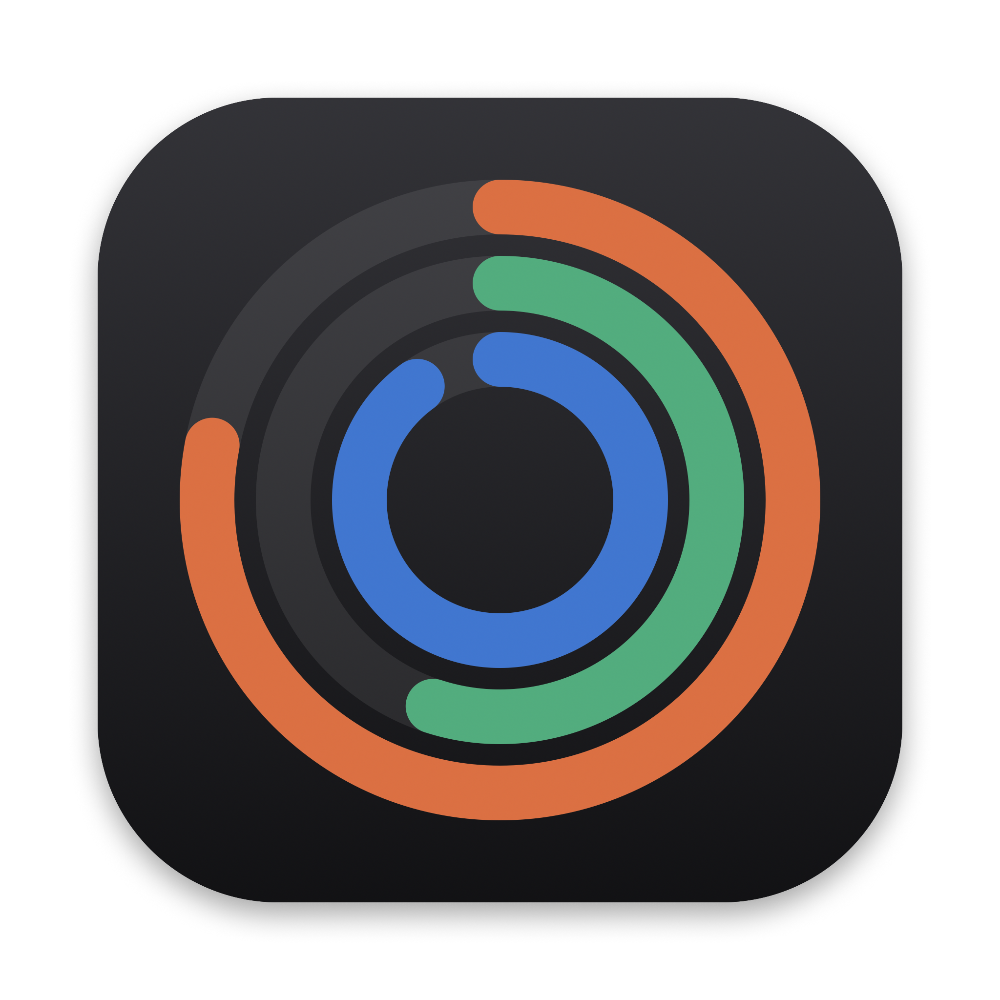
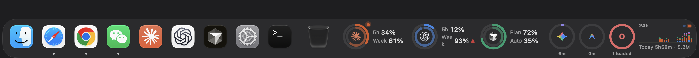
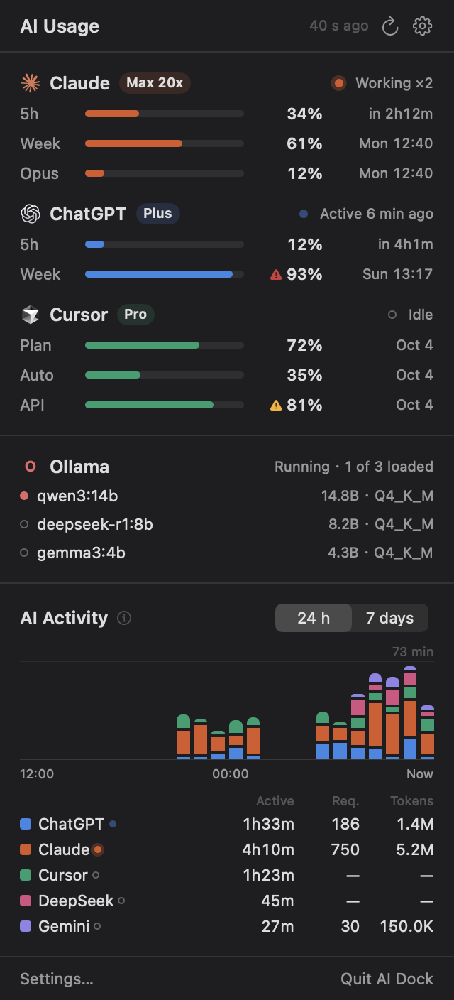
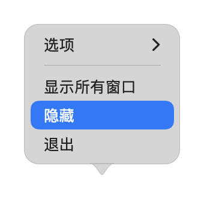
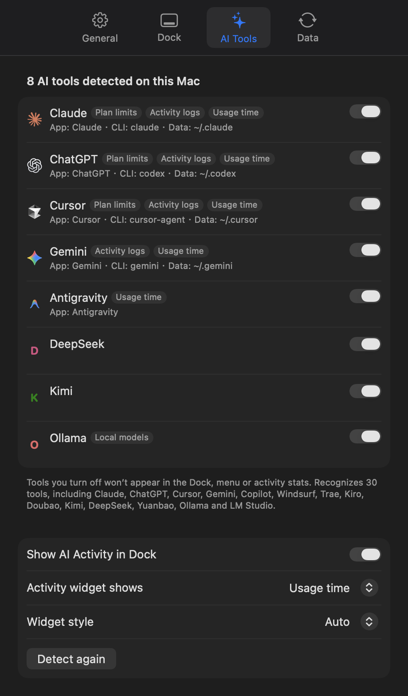
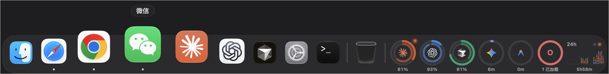

<div align="center">



# AI Dock

**A native-feeling replacement for the macOS Dock, with your AI plan limits and AI activity built in.**

English · [简体中文](README.zh-CN.md)

[](https://github.com/007xf/ai-dock/releases)


[](LICENSE)



</div>

> [!WARNING]
> AI Dock is an **unofficial** hobby project. It is not affiliated with, endorsed by or sponsored by Apple, Anthropic, OpenAI, Anysphere (Cursor), Google or Dockset. It reads usage data from **undocumented** endpoints that can change or stop working at any time. Read the [Disclaimer](#disclaimer) before using it.

## What it does

AI Dock replaces the system Dock with a look-alike that behaves the same way, then adds AI widgets on the right side of the bar.

**A Dock that behaves like the real one**

- Your apps, running indicators, recent apps and Trash, imported from the system Dock on first launch.
- Fisheye magnification, name labels, and launch bounce.
- Drag to reorder, drag apps or folders in to add, drag out to remove (with the "poof").
- Drop files on an app to open them with it, on a folder to move them in, or on the Trash.
- Context menus match the system Dock's structure, wording (read from the system's own localization files) and callout style: Options ▸ Keep in Dock / Open at Login / Show in Finder, Show All Windows, Hide, Quit. Hold ⌥ for Hide Others / Force Quit.
- ⌘-click shows the item in Finder. ⌥-click switches to the app and hides the previous one.
- Auto-hide uses the system Dock's own timing (`autohide-delay`, `autohide-time-modifier`). The Dock hides in full screen and appears when you push the pointer to the bottom edge.
- Clear or glass background; text color adapts to what is behind the Dock.

**AI widgets**

- **Plan limits** as rings for Claude (Claude Code), ChatGPT / Codex and Cursor: 5-hour and weekly windows with reset times.
- **AI activity**: a 24-hour / 7-day bar chart of active time or token usage per tool, parsed from local session logs.
- **Auto-detection** of 30 AI tools (Claude, ChatGPT, Cursor, Gemini, Copilot, Windsurf, Trae, Kiro, DeepSeek, Kimi, Ollama, LM Studio…). Widgets are generated from what each tool supports.
- **Local models**: loaded and downloaded models for Ollama and LM Studio.
- **API balances**: paste any key and the platform is detected from its format. Supported: DeepSeek, Moonshot (Kimi), SiliconFlow, OpenRouter.
- **Menu bar panel** with the same data, plus a tabbed Settings window.
- **8 UI languages**: English, 简体中文, 繁體中文, 日本語, 한국어, Español, Français and Deutsch. You can also follow the system language.

**Low overhead**

- Event-driven (FSEvents, workspace notifications), with no polling while idle.
- About 0% CPU and roughly 30–40 MB of memory at idle on the author's machine.

## Screenshots

| Menu bar panel | Dock menu | Settings |
|---|---|---|
|  |  |  |



*Screenshots are rendered with demo data (`AIDock --render <dir>`).*

## Requirements

- macOS 26 (Tahoe) or later on Apple silicon or Intel. It was developed and tested on macOS 27.
- To show plan limits, the matching tool must be signed in on this Mac: Claude Code, the Codex CLI or ChatGPT app, and Cursor.

## Install

1. Download `AI-Dock-x.y.z.zip` from [Releases](https://github.com/007xf/ai-dock/releases), unzip it, and move **AI Dock.app** to `/Applications`.
2. The app is ad-hoc signed, not notarized, so Gatekeeper blocks the first launch. Either right-click the app, choose **Open**, then **Open**, or run:
   ```bash
   xattr -dr com.apple.quarantine "/Applications/AI Dock.app"
   ```
3. On first launch AI Dock asks whether to hide the system Dock. Choosing **Hide** turns on auto-hide for the system Dock with a very long delay, so only AI Dock is visible. Quitting AI Dock restores your original settings.

## Usage

- **Menu bar icon**: open the usage panel, refresh, or go to Settings (⌘,).
- **Dock**: works like the system Dock. Right-click a divider or empty space for Turn Hiding On/Off, Turn Magnification On/Off, Minimize Using and Dock Settings….
- **Widgets**: click a ring for details. Right-click a widget to refresh now or to switch the activity chart between 24 h / 7 d and active time / tokens.
- **Settings**:
  - *General*: language, use AI Dock, hide the system Dock, menu bar icon, launch at login.
  - *Dock*: auto-hide, icon size, magnification, background.
  - *AI Tools*: show or hide each detected tool, activity widget options.
  - *Data*: refresh interval, where each number comes from, and API keys.
- **API balance**: Settings → Data → paste a key → Add. Keys are stored in your login Keychain and only sent to the platform they belong to.
- **Open at Login** (in the Dock menu) and **Empty Trash** use Apple Events, so macOS asks once for permission to control System Events / Finder.

## Where the data comes from

Everything runs locally. There is no server, analytics or telemetry.

| Tool | Plan limits | Credentials used |
|---|---|---|
| Claude Code | `api.anthropic.com/api/oauth/usage` | Keychain item `Claude Code-credentials` or `~/.claude/.credentials.json` |
| ChatGPT / Codex | `chatgpt.com/backend-api/wham/usage`; falls back to `rate_limits` in local session logs | `~/.codex/auth.json` |
| Cursor | `cursor.com/api/usage-summary` (legacy: `/api/usage`) | Cursor's local `state.vscdb`, opened read-only |

- **Activity** comes from local session logs in `~/.claude/projects`, `~/.codex/sessions`, `~/.gemini/tmp` and `~/.qwen/tmp`, plus how long each AI app is frontmost (idle time over 5 minutes is excluded). Token counts include cache tokens, so they line up with the official dashboards. Daily totals use your local day, while some dashboards use UTC days.
- **Token renewal**:
  - When the Claude or Codex access token has expired, AI Dock uses the stored refresh token with the same OAuth flow the CLI uses. It writes the new token back to where it was read (Keychain or file), so the CLI keeps working.
  - Cursor is never written to. If its sign-in has expired, AI Dock asks you to open Cursor.

## Build from source

Xcode Command Line Tools are enough; full Xcode is not required.

```bash
git clone https://github.com/007xf/ai-dock.git
cd ai-dock
./build.sh                      # → build/AI Dock.app
open "build/AI Dock.app"
```

- `swift scripts/make_logos.swift` (optional) extracts sharper brand logos from the apps installed on your Mac into `Resources/Logos`, for your own build. Logos are not included in this repository or in releases; without them AI Dock extracts logos from installed app icons at runtime.
- `"build/AI Dock.app/Contents/MacOS/AIDock" --render /tmp/preview` renders the UI with demo data to PNG files.

## Uninstall

1. Quit AI Dock from the menu bar panel. This restores the system Dock.
2. Delete `/Applications/AI Dock.app`.
3. Optionally remove its data:
   ```bash
   rm -rf ~/Library/Application\ Support/AIDock
   defaults delete local.aidock.app
   ```
4. If the system Dock is still hidden (for example because AI Dock was force-quit), restore it:
   ```bash
   defaults delete com.apple.dock autohide-delay; defaults write com.apple.dock autohide -bool false; killall Dock
   ```

## Known limitations

- **Things only the system Dock can do**: notification badges, bounce-for-attention, app-provided Dock menu items (such as System Settings panes), the window list in the menu, and minimized-window thumbnails. Enabling *Minimize windows into application icon* in System Settings works well with AI Dock.
- **Not supported yet**: stacks (fan/grid) for folders, and placing the Dock on the left or right.
- **Brittle plan-limit endpoints**: they are private and may change without notice.

## Disclaimer

- **Not official.** AI Dock is an independent, unofficial project. It has no affiliation with, and is not endorsed by, Apple Inc., Anthropic PBC, OpenAI, Anysphere Inc. (Cursor), Google LLC, Dockset, or any other company mentioned here. All product names, logos and trademarks belong to their respective owners and are used only to identify the corresponding services.
- **Undocumented endpoints.** Plan limits are read from undocumented endpoints used by the official clients, with credentials that already exist on your Mac. These endpoints may change, break, be rate-limited, or be considered outside a provider's terms of service. Check the terms of each service you use. You are solely responsible for how you use this software.
- **It changes local state.** It can change system Dock preferences (auto-hide and its delay; minimize effect when you choose it), write refreshed OAuth tokens back to their original Keychain item or file, store API keys in your Keychain, and add login items or empty the Trash when you ask it to.
- **Displayed numbers may be wrong.** Usage, activity and balance figures are best-effort estimates and may differ from the official dashboards. Do not rely on them for billing decisions.
- **No warranty.** The software is provided "as is", without warranty of any kind, as stated in the [MIT License](LICENSE). The authors are not liable for any claim, damage, account action, data loss or other liability arising from its use.

## License

[MIT](LICENSE) © 2026 007xf
