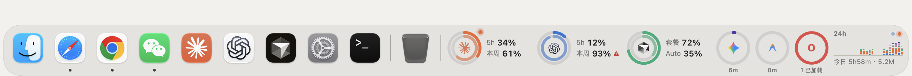
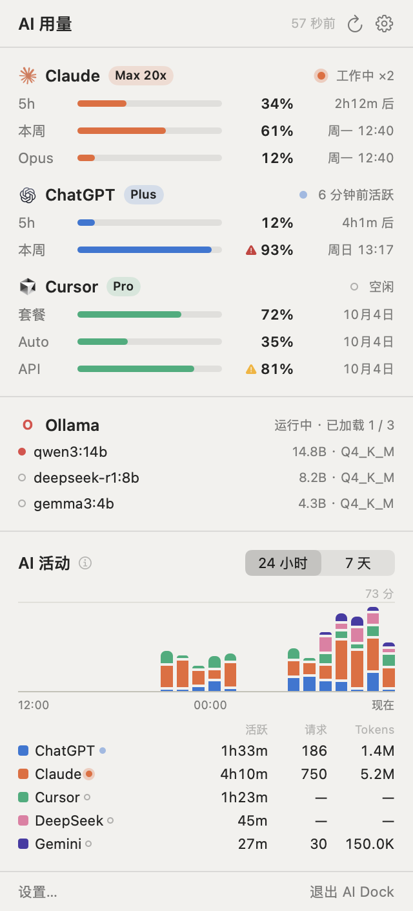
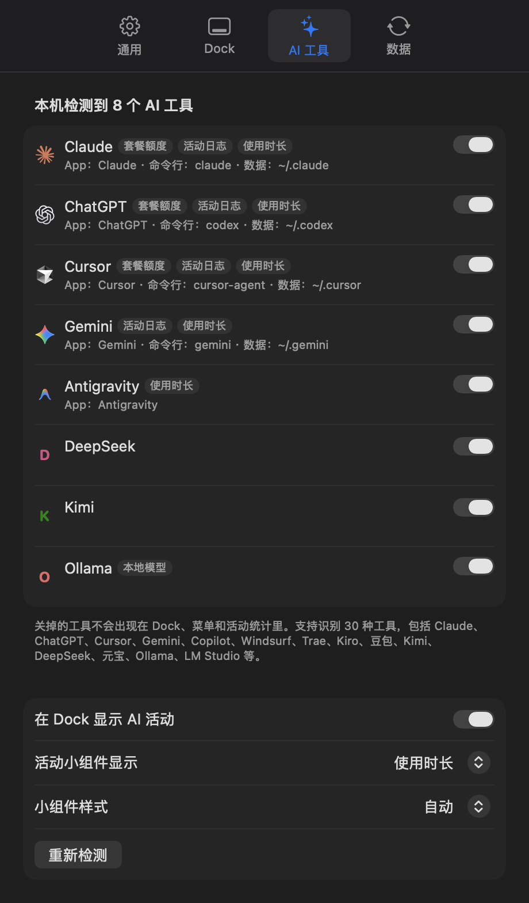

<div align="center">


# AI Dock

**用起来和原生一样的 macOS Dock 替代品，内置 AI 套餐额度和 AI 活动统计。**

[English](README.md) · 简体中文

[](https://github.com/007xf/ai-dock/releases)


[](LICENSE)



</div>

> [!WARNING]
> AI Dock 是**非官方**的个人项目，与 Apple、Anthropic、OpenAI、Anysphere（Cursor）、Google、Dockset 均无任何关联，也未获得其认可或赞助。额度数据来自**未公开的接口**，随时可能变化或失效。使用前请先阅读[免责声明](#免责声明)。

## 功能

AI Dock 用一条外观和行为都和系统 Dock 一致的 Dock 替换系统 Dock，再在右侧加上 AI 小组件。

**和原生一致的 Dock**

- 常用 App、运行指示灯、最近使用的 App、废纸篓，第一次启动时从系统 Dock 导入。
- 鱼眼放大、名称标签、启动跳动。
- 拖动排序，拖进 App 或文件夹来添加，拖出 Dock 移除（带「噗」的烟雾效果）。
- 文件拖到 App 上用它打开，拖到文件夹上放进去，拖到废纸篓上删除。
- 右键菜单的结构、文案（直接读取系统自带的本地化文件）和带尖角的样式都与系统 Dock 相同：选项 ▸ 在程序坞中保留 / 登录时打开 / 在访达中显示，显示所有窗口，隐藏，退出。按住 ⌥ 变为「隐藏其他」「强制退出」。
- ⌘ 点按在访达中显示；⌥ 点按切换到该 App 并隐藏刚才的 App。
- 自动隐藏沿用系统 Dock 自己的节奏（`autohide-delay`、`autohide-time-modifier`）。全屏时隐藏，把鼠标推到屏幕底边会出现。
- 可选透明或玻璃背景；文字颜色根据 Dock 背后的明暗自动调整。

**AI 小组件**

- **套餐额度**：Claude（Claude Code）、ChatGPT / Codex、Cursor 的 5 小时和每周窗口用圆环显示，附重置时间。
- **AI 活动**：24 小时 / 7 天柱状图，按工具显示使用时长或 Token 用量，数据来自本地会话日志。
- **自动检测**：识别 30 种 AI 工具（Claude、ChatGPT、Cursor、Gemini、Copilot、Windsurf、Trae、Kiro、DeepSeek、Kimi、Ollama、LM Studio 等），根据每个工具支持的数据生成小组件。
- **本地模型**：显示 Ollama、LM Studio 已加载和已下载的模型。
- **API 余额**：粘贴任意 Key，按格式自动识别平台。支持 DeepSeek、Moonshot（Kimi）、硅基流动、OpenRouter。
- **菜单栏面板**：显示同样的数据，另有分标签页的设置窗口。
- **8 种界面语言**：简体中文、繁體中文、English、日本語、한국어、Español、Français、Deutsch，也可以跟随系统。

**低开销**

- 事件驱动（FSEvents、系统通知），空闲时不轮询。
- 在作者的电脑上，空闲时 CPU 约 0%，内存约 30–40 MB。

## 截图

| 菜单栏面板 | Dock 菜单 | 设置 |
|---|---|---|
|  |  |  |


*截图用示例数据渲染（`AIDock --render <目录>`）。*

## 系统要求

- macOS 26（Tahoe）或更高版本，Apple 芯片或 Intel 均可。开发和测试环境为 macOS 27。
- 要显示套餐额度，需要在这台 Mac 上登录对应工具：Claude Code、Codex 命令行或 ChatGPT App、Cursor。

## 安装

1. 在 [Releases](https://github.com/007xf/ai-dock/releases) 下载 `AI-Dock-x.y.z.zip`，解压后把 **AI Dock.app** 拖进「应用程序」。
2. App 使用本地临时签名（ad-hoc），没有经过 Apple 公证，第一次打开会被系统拦截。可以右键点按 App，选「打开」，再点「打开」；也可以在终端运行：
   ```bash
   xattr -dr com.apple.quarantine "/Applications/AI Dock.app"
   ```
3. 第一次启动会询问是否隐藏系统 Dock。选「隐藏」后，系统 Dock 会打开自动隐藏并把弹出延迟设得很长，屏幕上只留下 AI Dock。退出 AI Dock 时会恢复你原来的设置。

## 使用方法

- **菜单栏图标**：查看用量面板、立即刷新、打开设置（⌘,）。
- **Dock**：和系统 Dock 用法一样。在分隔线或空白处右键，可以启用/关闭隐藏、启用/关闭放大、设置「最小化时使用」、打开「程序坞设置…」。
- **小组件**：点按圆环看详情。右键小组件可以立即刷新；活动小组件还能切换 24 小时 / 7 天，以及使用时长 / Token 用量。
- **设置**：
  - *通用*：语言、启用 AI Dock、隐藏系统 Dock、菜单栏图标、登录时自动启动。
  - *Dock*：自动隐藏、图标大小、放大、背景。
  - *AI 工具*：每个检测到的工具单独显示或隐藏，活动小组件选项。
  - *数据*：刷新间隔、每项数据的来源，以及 API Key。
- **API 余额**：设置 → 数据 → 粘贴 Key → 添加。Key 保存在你的登录钥匙串里，只发送给它所属的平台。
- **登录时打开**（Dock 菜单里）和**清倒废纸篓**要用到 Apple 事件，macOS 会请求一次授权，允许控制「系统事件」/「访达」。

## 数据来源

所有处理都在本机完成，没有服务器，也没有统计或遥测。

| 工具 | 套餐额度 | 使用的登录信息 |
|---|---|---|
| Claude Code | `api.anthropic.com/api/oauth/usage` | 钥匙串「Claude Code-credentials」或 `~/.claude/.credentials.json` |
| ChatGPT / Codex | `chatgpt.com/backend-api/wham/usage`；失败时改用本地会话日志里的 `rate_limits` | `~/.codex/auth.json` |
| Cursor | `cursor.com/api/usage-summary`（旧套餐：`/api/usage`） | Cursor 本地的 `state.vscdb`，只读打开 |

- **AI 活动**来自 `~/.claude/projects`、`~/.codex/sessions`、`~/.gemini/tmp`、`~/.qwen/tmp` 下的本地会话日志，再加上各 AI App 在前台的时长（离开超过 5 分钟的部分不计）。Token 数包含缓存 Token，和官方面板的口径一致。每日统计按本地时间划分，有些官方面板按 UTC 划分。
- **登录续期**：
  - Claude 或 Codex 的访问令牌过期时，AI Dock 用已保存的续期令牌，按命令行工具相同的 OAuth 流程换新令牌，并写回原来的位置（钥匙串或文件），命令行工具之后照常可用。
  - AI Dock 从不写入 Cursor 的数据。Cursor 登录过期时，会提示你打开 Cursor。

## 从源码构建

只需要 Xcode Command Line Tools，不需要完整的 Xcode。

```bash
git clone https://github.com/007xf/ai-dock.git
cd ai-dock
./build.sh                      # 生成 build/AI Dock.app
open "build/AI Dock.app"
```

- `swift scripts/make_logos.swift`（可选）：从本机已安装的 App 中提取更清晰的品牌标志到 `Resources/Logos`，仅供自己构建使用。仓库和发布包都不包含这些标志；没有时，AI Dock 会在运行时从已安装 App 的图标中提取。
- `"build/AI Dock.app/Contents/MacOS/AIDock" --render /tmp/preview`：用示例数据把界面渲染成 PNG。

## 卸载

1. 在菜单栏面板里退出 AI Dock，系统 Dock 会自动恢复。
2. 删除 `/Applications/AI Dock.app`。
3. 如需清除数据：
   ```bash
   rm -rf ~/Library/Application\ Support/AIDock
   defaults delete local.aidock.app
   ```
4. 如果系统 Dock 仍然被隐藏（比如 AI Dock 被强制退出过），运行下面的命令恢复：
   ```bash
   defaults delete com.apple.dock autohide-delay; defaults write com.apple.dock autohide -bool false; killall Dock
   ```

## 已知限制

- **只有系统 Dock 能做到的功能**：通知角标、请求注意时的跳动、App 自己提供的 Dock 菜单项（比如「系统设置」的面板列表）、菜单里的窗口列表、最小化窗口的缩略图。建议在系统设置里打开「将窗口最小化为应用程序图标」，和 AI Dock 配合得更好。
- **暂不支持**：文件夹的叠放（扇状/网格），以及把 Dock 放在屏幕左右两侧。
- **额度接口不稳定**：这些接口是非公开的，可能随时变化。

## 免责声明

- **非官方**：AI Dock 是独立的非官方项目，与 Apple Inc.、Anthropic PBC、OpenAI、Anysphere Inc.（Cursor）、Google LLC、Dockset 及文中提到的任何公司均无关联，也未获得其认可。文中所有产品名称、标志和商标均归各自所有者所有，仅用于指明对应的服务。
- **使用未公开接口**：套餐额度通过官方客户端使用的未公开接口读取，使用的是你电脑上已有的登录信息。这些接口可能变化、失效、被限流，也可能不符合服务商的使用条款。请自行查阅所用服务的条款；如何使用本软件由你自行负责。
- **会修改本机状态**：本软件可能修改系统 Dock 的偏好设置（自动隐藏及其延迟；你选择时还包括最小化效果），把续期后的 OAuth 令牌写回原来的钥匙串条目或文件，把 API Key 存入钥匙串；在你要求时，还会添加登录项或清倒废纸篓。
- **显示的数字可能不准确**：用量、活动、余额等数据均为尽力估算，可能与官方面板不同，请勿作为计费依据。
- **不提供任何担保**：本软件按「原样」提供，不附带任何形式的担保，详见 [MIT 许可证](LICENSE)。作者不对因使用本软件而产生的任何索赔、损害、账号处置、数据丢失或其他责任承担责任。

## 许可证

[MIT](LICENSE) © 2026 007xf
